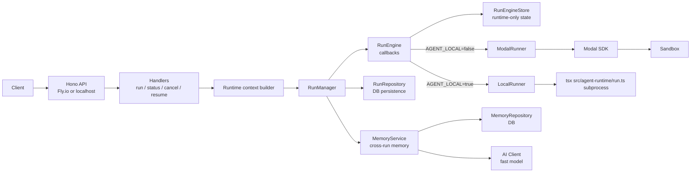

# Research Agent

Hono server that orchestrates AI agent (Claude) runs. Runs on Fly.io (production) or localhost (dev). Executes the agent in a Modal sandbox or locally as a subprocess.

## Source layout

- `src/app/` – Application bootstrap, router wiring, graceful shutdown
- `src/http/` – Transport layer (handlers, middlewares, validation, context types)
- `src/runs/` – Run lifecycle orchestration, store, repository, runtime context
- `src/documents/` – Background document text extraction (poll loop + worker thread)
- `src/memory/` – Cross-run memory feature (service, repository, keyword extraction, AI client)
- `src/infra/` – Shared infrastructure (logger, Modal setup, target API client)
- `src/agent-runtime/` – Sandboxed agent entrypoint
- `src/runners/` – Runner implementations (local subprocess, Modal)
- `scripts/` – Operator scripts (deploy-agent)

## Architecture



### Flow (high-level)

1. Client sends request to `/api/agent/run`.
2. Handler validates payload and appends runtime context (`skill`, `projectId`) to the prompt.
3. `RunManager` delegates to `RunEngine`, which creates the run in `RunEngineStore` and dispatches execution to the selected runner:
   - `ModalRunner` in production-like mode (`AGENT_LOCAL=false`)
   - `LocalRunner` in local mode (`AGENT_LOCAL=true`)
4. Runner returns `result` or `error`; `RunEngine` communicates state changes via callbacks (`onStatusChange`, `onLogsFlush`, `onRunCompleted`).
5. `RunManager` persists terminal state to DB via `RunRepository` and memories via `MemoryService`. API exposes state via status endpoint.

### Components

| Component | Role |
|-----------|------|
| **app/server.ts** | Entrypoint. Validates env, creates repository/engine/manager, picks runner by `AGENT_LOCAL`, starts Hono server, reconciles orphaned runs. |
| **http/handlers** | Parse request, validate payload, build runtime context, start run. |
| **RunManager** | Orchestration facade over engine + DB repository + memory (start/status/cancel/resume). Persists terminal state and processes memories. |
| **RunEngine** | Run lifecycle orchestration via callbacks. Manages creation, execution, messaging, and cancellation. Has no direct DB dependency. |
| **RunEngineStore** | In-memory runtime-only state: abort controller, log buffer, completion flag. All persistent state lives in the database. |
| **ModalRunner** | Executes bundled runtime in Modal sandbox via `tsx /app/run.js` (via Modal SDK). |
| **LocalRunner** | Spawns local `tsx src/agent-runtime/run.ts` subprocess for development. |
| **RunRepository** | Persistence layer for run state, messages, and logs (tables from `@wildfires-org/turboplan-db`). |
| **MemoryService** | Cross-run self-improvement. Queries relevant past memories before a run, parses and saves new memories after completion. Uses a lightweight Anthropic SDK wrapper for keyword extraction. |
| **scripts/deploy-agent.ts** | Uploads bundled agent runtime (`dist/agent-runtime/run.js`) and skills to Modal volume. |

## Endpoints

| Method | Path | Description |
|--------|------|-------------|
| GET | `/health` | Health check (no auth) |
| POST | `/api/agent/run` | Start async run. Body: `{ prompt, webhookSecret, skill?, projectId? }`. Returns `{ runId, status }` (202) |
| GET | `/api/agent/run/:runId` | Status and result. Returns `{ runId, status, result?, error?, logs? }` |
| POST | `/api/agent/run/:runId/cancel` | Cancel a running agent. Returns `{ message, runId }` (200) |
| POST | `/api/agent/run/:runId/add-context` | Add context to `created`/`running` runs. For terminal runs, returns `409` and directs to `/resume` |
| POST | `/api/agent/run/:runId/resume` | Resume a terminal run under the same `runId`. For `completed`, `prompt` is required; for `failed/cancelled/timeout` it is optional |
| POST | `/api/documents/extract` | Nudge the document extraction loop to run now. Body: `{ documentIds?: string[] }` (optional, logged only). Returns `{ queued: true }` (202) |

All `/api/*` endpoints require the `x-api-key` header (`AGENT_API_KEY`); `/api/agent/*` and `/api/documents/*` are additionally behind the `ALLOWED_ORIGINS` origin guard.

When `webhookSecret` is provided in the request body, it is forwarded as `$WEBHOOK_SECRET` env var to the agent runtime for authenticated callbacks to the target API.

`/add-context` and `/resume` are intentionally separate: `/add-context` injects context into an in-flight run, while `/resume` reopens a terminal run (DB-backed rehydration) with its own state-specific prompt rules.

## Configuration

See `.env.example` for all variables. Highlights:

- `AGENT_API_KEY` – API auth for `/api/agent/*`
- `POSTGRES_URL` – Postgres connection (persistence via `@wildfires-org/turboplan-db`)
- `AGENT_LOCAL=true` – run agent as a local subprocess instead of Modal
- `MODAL_TOKEN_ID` / `MODAL_TOKEN_SECRET` – required when not in local mode
- `ANTHROPIC_API_KEY`, `CLAUDE_MODEL` – passed to the agent runtime
- `OPENROUTER_API_KEY` – optional; when set, all model traffic (Agent SDK + fast model) routes through OpenRouter's Anthropic-compatible endpoint (cost tracking in the OpenRouter dashboard). Takes precedence over `ANTHROPIC_API_KEY`
- `RUN_TIMEOUT_MS` – max runtime for a single run (default `600000` = 10 minutes)

Run tables (`researchAgentRuns`, `researchAgentRunMessages`, `researchAgentRunLogs`) are part of the shared schema in `packages/core/turboplan-db`; apply them with the monorepo's normal DB workflow (`pnpm db:push` / `db:migrate` from `apps/turboplan`).

## Memory (cross-run self-improvement)

The run manager maintains a memory of insights across agent runs so the agent can learn from past discoveries and avoid redundant work.

1. **Before a run**: extracts keywords from the prompt (via the fast model, falling back to text splitting when `CLAUDE_FAST_MODEL` is unset), queries the DB for relevant past insights by keyword overlap, and injects them into the runtime context.
2. **After a run**: parses the agent's result for a `---MEMORIES---` / `---END_MEMORIES---` block, saves the structured memories (title, content, keywords) to the DB, and strips the markers from the returned result.

Agent-side format:

```
---MEMORIES---
[
  {
    "title": "Short title",
    "content": "Detailed insight",
    "keywords": ["keyword1", "keyword2"]
  }
]
---END_MEMORIES---
```

## Document text extraction

Project documents (PDF, DOC, DOCX) are parsed here, not in the Cloudflare
Worker — Workers cannot afford a PDF parser's memory or CPU.

- **What runs** – a background loop polls `project_document` for rows with
  `extraction_status = 'pending'` (oldest first, 5 per batch) and extracts their
  text with `@wildfires-org/turboplan-document-extraction`.
- **Where it runs** – each document is parsed in a `worker_threads` worker
  capped at a 256MB heap (48MB young generation) with a 120s timeout. Documents
  are processed **one at a time**: the Fly VM only has 512MB. A blown cap or a
  hung parse kills the thread and is recorded as a failure; the server keeps
  serving.
- **Poll interval** – 5s. `POST /api/documents/extract` wakes the loop
  immediately (the call is a nudge, not a queue — `documentIds` is currently
  logged only, and the wake is ignored while a pass is already in flight).
- **Statuses written back** – `done` (with `extracted_text`), `unsupported`
  (mime type the extractor does not handle), `failed` (fetch or parse error,
  with the message in `extraction_error`). A row that cannot be persisted stays
  `pending` and is retried on a later pass.
- **Observability** – `GET /health` reports
  `components.documentExtraction = { inFlight, lastRunAt, processed, failed }`.

## Orphaned runs after restart

Runtime-only state (`AbortController`, process/sandbox handle) lives in memory and is lost on restart. On startup, `reattachOrphanedRuns` reconciles runs stuck in `created`/`running`:

- **Modal mode**: runs with a live sandbox are reattached; runs with a dead sandbox or no `sandboxId` are marked `failed`.
- **Local mode**: no reconciliation — local subprocesses cannot be reattached.

## Local Setup

> [!WARNING]
> **Local mode runs the agent on your machine with no sandbox.**
>
> In production the agent executes inside a Modal sandbox. `pnpm dev` starts it
> in *local mode*, where the agent is a plain subprocess on your host — and the
> Claude Agent SDK grants it the tool set of whoever started it: `Bash`,
> `WebFetch`, `WebSearch`, cron creation, and full Playwright browser control
> (including `browser_run_code_unsafe`).
>
> That matters because the same run also reads **untrusted content from the
> web**. A page the agent fetches during research can carry instructions, and
> those instructions reach a `Bash` tool pointed at your own account — the
> prompt-injection exposure that the Modal sandbox exists to contain. Your
> `.env.local` sits in this directory, so live API keys are within its reach.
>
> The SDK also loads skills from the repository root, not only from
> `workspace/.claude/skills`, so the agent inherits unrelated project skills.
> Check the `[agent] init | … | skills:` line it logs at startup to see exactly
> what a run can invoke.
>
> Practical guidance:
>
> - Drive local runs with prompts **you wrote**, not open-ended research that
>   crawls arbitrary sites.
> - Use Modal mode for anything resembling real work.
> - Treat `POST /api/agent/run` as billable — each run is a real model call.
>   `https://127.0.0.1/…` and `https://[::1]/…` are accepted as `targetApiUrl`
>   on purpose for local development, so a "should be rejected" SSRF test will
>   happily start a paid run instead.

```bash
# Install monorepo dependencies from repo root
pnpm install

# Enter package directory
cd apps/research-agent

# Copy env and fill in values (dev script loads .env.local)
cp .env.example .env.local

# Local mode (agent runs as subprocess) — port 3003
pnpm dev

# Test
curl http://localhost:3003/health
curl -X POST http://localhost:3003/api/agent/run \
  -H "x-api-key: your-secret-key" \
  -H "Content-Type: application/json" \
  -d '{"prompt": "Hello"}'
```

## Testing

The testing goal is business reliability, not raw line coverage. Keep tests few, business-critical, and built on real production classes — mock only external boundaries. See `tests/README.md` for details.

```bash
# From repo root
pnpm --filter @wildfires-org/research-agent test        # HTTP lifecycle tests (same suite as test:e2e)
pnpm --filter @wildfires-org/research-agent test:unit   # domain rules and API contracts
pnpm --filter @wildfires-org/research-agent test:e2e    # HTTP lifecycle tests
pnpm --filter @wildfires-org/research-agent typecheck
```

## Production

Prerequisite (Fly.io CLI):

```bash
brew install flyctl
```

1. Upload agent code to Modal volume: `pnpm deploy:agent`
2. Build/deploy research-agent to Fly.io: `pnpm deploy:fly`
3. Full deploy (Modal + Fly): `pnpm deploy`
4. Set secrets: `AGENT_API_KEY`, `MODAL_TOKEN_ID`, `MODAL_TOKEN_SECRET`, `ANTHROPIC_API_KEY` (or `OPENROUTER_API_KEY`), `TARGET_API_*`

`flyctl deploy` intentionally uses the monorepo root as Docker build context so the workspace files (`pnpm-lock.yaml`, `pnpm-workspace.yaml`, root `package.json`) are available. The final image contains only research-agent: the Dockerfile builds and deploys with `--filter @wildfires-org/research-agent` and copies only its artifacts.

Production runtime executes the built artifact (`dist/app/server.js`) with Node.js; local development uses `tsx watch`.
